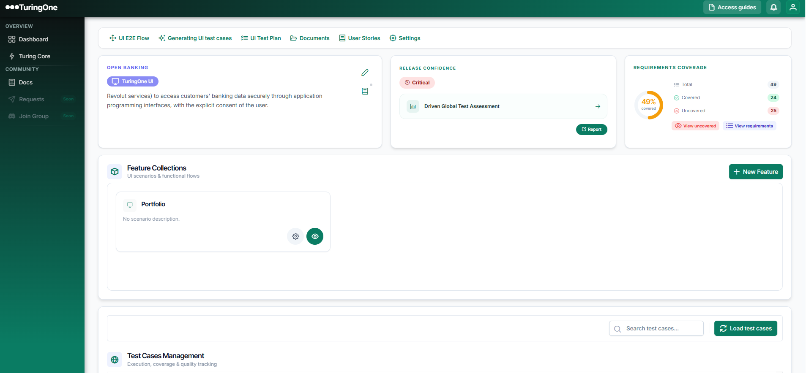
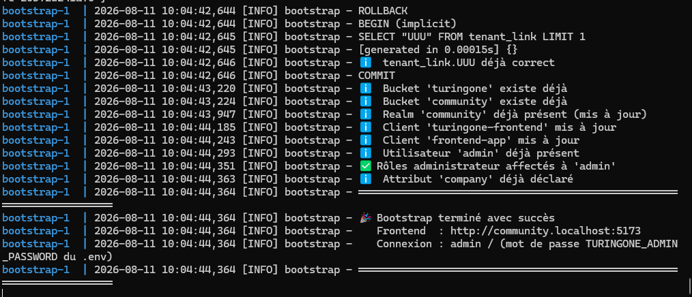
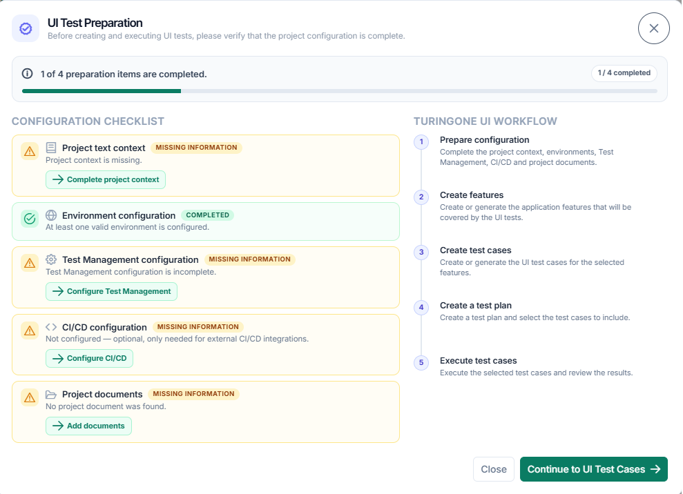
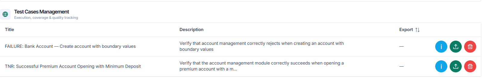
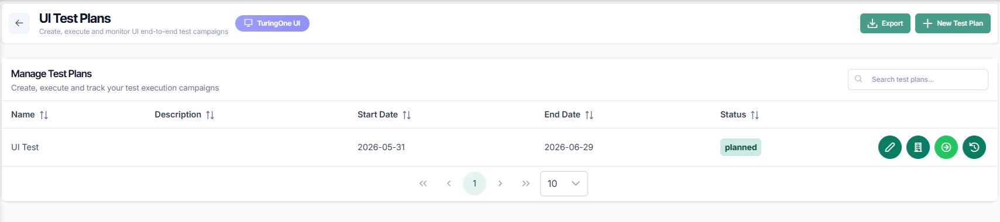
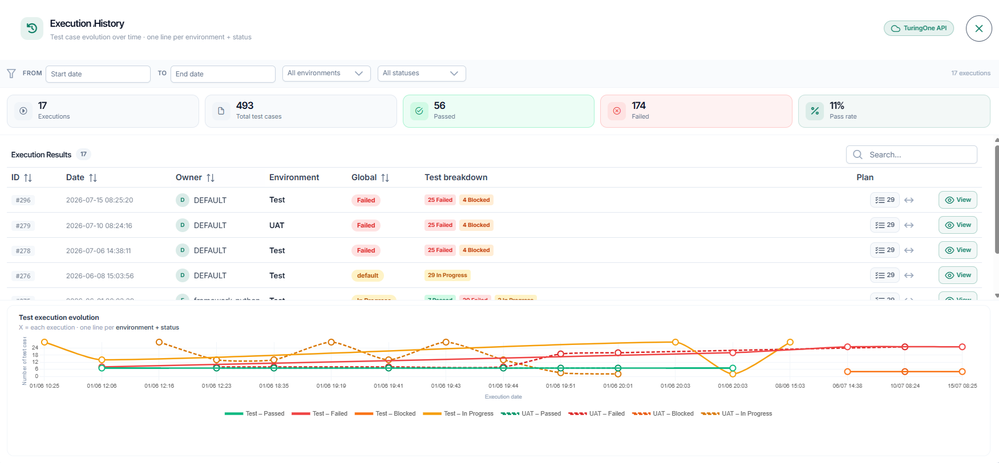
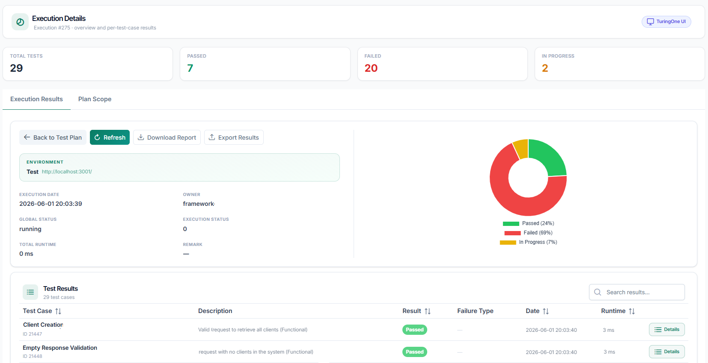

<div align="center">

# TuringOne Community

**Self-hosted AI-powered UI test automation.**

`Prepare` → `Generate` → `Plan` → `Execute` → `Report`

TuringOne Community generates and manages your UI tests centrally,
while execution remains inside your authorized environment.

*No dedicated CI runner. No persistent agent. No Docker required for test execution.*

[](https://docs.docker.com/compose/)
[](https://playwright.dev/)
[](https://www.keycloak.org/)
[](LICENSE)



</div>

---

## Table of contents

- [Why TuringOne Community](#why-turingone-community)
- [What you get](#what-you-get)
- [Architecture](#architecture)
- [Requirements](#requirements)
- [Quick start](#quick-start)
- [First login](#first-login)
- [Using it](#using-it)
  - [1 · Prepare your project](#1--prepare-your-project)
  - [2 · Generate UI tests with AI](#2--generate-ui-tests-with-ai)
  - [3 · Build your Test Plan](#3--build-your-test-plan)
  - [4 · Execute and analyze results](#4--execute-and-analyze-results)
- [Configuration](#configuration)
- [Operations](#operations)
- [Troubleshooting](#troubleshooting)
- [Security](#security)
- [License](#license)

---

## Why TuringOne Community

Enterprise test automation often needs to operate within strict infrastructure,
security and network constraints. Test execution may need to remain inside the
target environment, while installing dedicated CI runners or persistent agents is
not always possible.

TuringOne Community is designed for these environments. The platform runs on your
own infrastructure, while UI tests are executed from an authorized execution
environment using a lightweight TuringOne workspace.

**No dedicated CI runner. No persistent execution agent. No Docker required in the
execution environment.**

| | |
|---|---|
| 🧠 **AI-powered test generation** | Turn requirements and project documentation into UI test cases |
| ⚡ **Runner-free execution** | Execute tests directly from the TuringOne workspace without deploying a dedicated CI runner |
| 🔒 **Self-hosted platform** | Keep application data, configuration and execution control within your infrastructure. LLM connectivity remains configurable and can use either cloud or self-hosted providers |
| 🔌 **Bring your own LLM** | Connect any OpenAI-compatible endpoint — cloud-hosted or self-hosted |
| 📊 **Reports & traceability** | Track execution results, screenshots, test steps and requirement coverage |

## What you get

`docker compose up` gives you six services:

| Service | Role | Exposed |
|---|---|---|
| **frontend** | Vue 3 SPA served by Nginx | `:5173` |
| **backend** | FastAPI — projects, generation, executions | `:8000` |
| **keycloak** | Authentication (OIDC) | `:8080` |
| **postgres** | PostgreSQL 16 + pgvector — all application data | internal only |
| **minio** | S3-compatible storage for artifacts | internal only |
| **redis** | Cache | internal only |

> **Databases are never exposed.** PostgreSQL, MinIO and Redis sit on an
> `internal: true` Docker network with no published ports — unreachable from the
> host or the internet by design.

---

## Architecture

```
            TURINGONE PLATFORM                    EXECUTION ENVIRONMENT
                 (Docker)                        (TuringOne Workspace)
   ┌────────────────────────────────────────┐   ┌──────────────────────────┐
   │  frontend ── backend ── postgres       │   │  TuringOne workspace     │
   │                 │        minio         │   │   (retrieved once)       │
   │                 │        redis         │   │                          │
   │              keycloak                  │   │  Run Turing One Tests    │
   └─────────────────┬──────────────────────┘   │        │                 │
                     │                          │        ▼                 │
                     │  ① prepare run           │  execution_launcher.py   │
                     │◄─────────────────────────┤  ② claim next execution  │
                     │                          │  ③ pre-flight check      │
                     │                          │        │                 │
                     │                          │        ▼                 │
                     │                          │  run.py → Playwright     │
                     │  ④ progress + results    │        │                 │
                     │◄─────────────────────────┤  ⑤ report back           │
                     └──────────────────────────┴──────────────────────────┘
```

The execution workspace **initiates all communication** with the TuringOne server.
It retrieves pending executions, runs the selected tests, and sends progress and
results back to the platform.

The workspace does not listen on a port and does not require inbound connectivity,
making it suitable for restricted corporate environments.

---

## Requirements

| | Minimum | Recommended |
|---|---|---|
| Docker | Engine 24 + Compose v2 | Docker Desktop 4.30+ |
| RAM | 6 GB free | 8 GB |
| Disk | 10 GB free | 20 GB |
| OS | Linux, macOS, Windows (WSL2) | — |

For running tests locally you also need **Node.js 18+** and **Python 3.9+** on the
execution environment. Both are usually already present, and neither requires
administrator rights.

---

## Quick start

```bash
git clone https://github.com/aabouda/turingone-ui-community.git
cd turingone-ui-community
./install.sh
```

On Windows (PowerShell):

```powershell
.\install.ps1
```

The installer:

1. generates `.env` with strong random secrets (file mode `600`)
2. pulls the images (~2 GB, 5–15 min on first run)
3. starts the stack
4. provisions databases, the Keycloak realm, storage buckets and the admin user

When it finishes, open **<http://community.localhost:5173>**.

> ⚠️ **Back up your `.env`.** It contains `TURINGONE_MASTER_KEY`, without which your
> encrypted data cannot be recovered. It is git-ignored on purpose.



---

## First login

Credentials are generated during installation. Read them from your `.env`:

```bash
grep -E 'TURINGONE_ADMIN_(USERNAME|PASSWORD)' .env
```

| | |
|---|---|
| URL | <http://community.localhost:5173> |
| Username | `admin` |
| Password | value of `TURINGONE_ADMIN_PASSWORD` |

The Keycloak admin console lives at <http://localhost:8080> with
`KEYCLOAK_USERNAME_ADMIN` / `KEYCLOAK_PASSWORD_ADMIN` — a **separate** account,
for identity administration only.

On first login you are asked to complete your profile (first name, last name,
email, company).

---

## Using it

### 1 · Prepare your project

Create a project, then open it. The **UI Test Preparation** assistant checks
everything the generator needs and tells you what is missing:

- project text context
- at least one valid environment
- Test Management configuration
- at least one project document

CI/CD configuration is also reported, but it is **optional**: local execution goes
through the TuringOne workspace and requires neither Git nor a CI pipeline. Configure
it only if you want TuringOne to interact with an external CI/CD system.



### 2 · Generate UI tests with AI

Click **Generating UI test cases** in the project menu. TuringOne runs a single
job that produces the three UI categories — end-to-end, system and
non-regression — over the whole project scope, then **validates them
automatically**. No manual review step, no draft to approve.

Test cases already present are never regenerated: they are matched on normalised
title, test type and module.



### 3 · Build your Test Plan

Create a test plan, assign the test cases you want, and pick an environment.



### 4 · Execute and analyze results

TuringOne Community does not require a dedicated CI runner for test execution.
Instead, tests are launched from the TuringOne execution workspace inside your
authorized environment.

**Once per execution environment** — click **Download Workspace**. You get a 1 MB archive
containing the Playwright framework, your tests, and a one-time pairing code.
Unzip it and double-click:

| OS | File |
|---|---|
| Windows | `Run Turing One Tests.bat` |
| macOS | `Run Turing One Tests.command` |
| Linux | `./run-turingone-tests.sh` |

The launcher connects itself — **nothing to type, nothing to install.** On first
run it also fetches the npm dependencies and the Chromium browser.

**For every run afterwards** — click **Prepare Run** in TuringOne, then launch the
same file. The launcher claims the pending execution, runs a pre-flight check,
starts Playwright and streams progress back to the UI.

```
==============================================================
  TuringOne — UI test execution
==============================================================
  [OK]  Connected to project 1

  [OK]  Execution found
  Execution #12 · Regression Checkout · QA · 34 tests

  [ENTER] run   [Q] cancel

  [OK]  Framework      [OK]  Node.js        [OK]  Dependencies
  [OK]  Playwright     [OK]  Test Plan      [OK]  Environment
  Environment ready.
```




---

## Configuration

Everything lives in `.env`. Start from `.env.example`; the installer creates it
for you and fills the secrets.

### LLM provider — required for AI features

Point TuringOne at **any** OpenAI-compatible endpoint. These three variables
override every internal tier at once:

```env
LLM_API_URL=https://api.groq.com/openai/v1
LLM_API_TOKEN=gsk_...
LLM_MODEL=llama-3.3-70b-versatile
```

| Provider | `LLM_API_URL` | Example model |
|---|---|---|
| Groq | `https://api.groq.com/openai/v1` | `llama-3.3-70b-versatile` |
| OpenAI | `https://api.openai.com/v1` | `gpt-4o-mini` |
| Ollama (local) | `http://host.docker.internal:11434/v1` | `llama3` |
| vLLM (self-hosted) | `http://your-server:8000/v1` | your served model |

Verify the connection at any time:

```bash
docker exec turingone-community-backend-1 python -c "
from common.ollama_client import get_llm_client
c, m = get_llm_client('vllm_chat')
print(c.chat.completions.create(model=m,
      messages=[{'role':'user','content':'Say OK'}], max_tokens=5).choices[0].message.content)"
```

### Other useful settings

| Variable | Default | Purpose |
|---|---|---|
| `FRONTEND_PORT` | `5173` | Web UI port |
| `BACKEND_PORT` | `8000` | API port |
| `KEYCLOAK_PORT` | `8080` | Identity server port |
| `COMMUNITY_MAX_TEST_CASES_PER_PROJECT` | `15` | Test-case quota per project (`0` = unlimited) |
| `TURINGONE_PAIRING_TTL_MINUTES` | `10080` | Workspace pairing code lifetime (7 days) |
| `RABBITMQ_ENABLED` | `false` | Message broker — not needed for local execution |
| `TURINGONE_BACKEND_IMAGE` | `ghcr.io/…` | Override to use your own registry |
| `TURINGONE_FRONTEND_IMAGE` | `ghcr.io/…` | Override to use your own registry |

Changing a variable requires no rebuild:

```bash
docker compose up -d --force-recreate backend frontend
```

---

## Operations

```bash
# Status
docker compose ps

# Restart after a machine reboot
docker compose restart

# Update to a newer release
docker compose pull && docker compose up -d

# Follow the logs
docker compose logs -f backend

# Stop (data is preserved)
docker compose down

# Re-run provisioning — idempotent, safe at any time
docker compose run --rm bootstrap
```

**Backup.** Three things matter: your `.env` file, the `pgdata` volume and the
`miniodata` volume.

```bash
docker run --rm -v turingone-community_pgdata:/data -v "$PWD":/backup \
  alpine tar czf /backup/pgdata-$(date +%F).tar.gz -C /data .
```

> `docker compose down -v` **destroys every volume** — all projects, tests and
> users. Only use it for a deliberate reset, then re-run `./install.sh`.

---

## Troubleshooting

<details>
<summary><b>Keycloak reports unhealthy and the bootstrap fails</b></summary>

Usually a PostgreSQL volume left over from an earlier, incomplete install. The
`keycloak` database role never got created, and the init script only runs on an
**empty** volume.

```bash
docker compose down
docker volume rm turingone-community_pgdata
./install.sh
```
</details>

<details>
<summary><b>The backend takes a long time to become healthy</b></summary>

Normal on first boot: it downloads the embedding models. `start_period` is set to
180 s. Watch it with `docker compose logs -f backend`.
</details>

<details>
<summary><b>AI generation returns an empty or degraded result</b></summary>

Almost always an LLM configuration issue. Run the verification snippet from the
[Configuration](#configuration) section. A `401` means the key is wrong, a `404
model_not_found` means `LLM_MODEL` is not served by that provider.
</details>

<details>
<summary><b>The launcher says the pairing code expired</b></summary>

The code is single-use. If the workspace was already paired, or the code was
consumed, download the workspace again from **Test Plan → Run → Download
Workspace**.
</details>

<details>
<summary><b>"Workspace not connected" even after running the script</b></summary>

Make sure you launched the script from the folder you just unzipped. A browser
that downloads the archive twice creates a second folder, and the old one still
carries the consumed pairing code.
</details>

<details>
<summary><b>I need to inspect the database</b></summary>

PostgreSQL is not exposed on purpose. Use the container:

```bash
docker compose exec postgres psql -U turingone -d community
```
</details>

---

## Security

- Databases and object storage have **no published ports** — `internal: true` network.
- All secrets are generated at install time, stored in `.env` with mode `600`, and
  git-ignored.
- The workspace token used by the local launcher is **per project, revocable, and
  stored only as a SHA-256 hash** server-side.
- Nothing is written to a Git repository: the local-execution flow requires neither
  Git, nor Docker in the execution environment, nor a CI pipeline. CI/CD settings
  exist only for optional integration with external systems.

Found a vulnerability? See [SECURITY.md](SECURITY.md).

---

## License

TuringOne UI Community is licensed under the GNU Affero General Public License v3.0 (`AGPL-3.0-only`).

See the [LICENSE](LICENSE) file for the complete license terms.

Copyright © 2026 TuringOne

### Source code and modifications

If you modify TuringOne UI Community and make the modified version available to users over a network, the GNU Affero General Public License v3.0 may require you to make the corresponding source code of that modified version available to those users.

Please refer to the LICENSE file for the complete legal terms.

Source code: <https://github.com/aabouda/turingone-ui-community>

### Scope of this repository

This repository contains the deployment configuration for TuringOne Community —
the Compose file, the installation scripts, the bootstrap provisioning and the
Keycloak login theme. These files are covered by the AGPL-3.0-only license above.

The `backend` and `frontend` services are pulled as pre-built container images
(`TURINGONE_BACKEND_IMAGE` / `TURINGONE_FRONTEND_IMAGE`). Those images are
distributed separately and carry their own terms; the license of this repository
does not by itself determine the terms applying to them.

### Third-party components

TuringOne Community runs alongside independent components — including
PostgreSQL, Keycloak, MinIO, Redis and Playwright — each distributed under its
own license. Nothing here modifies your rights or obligations under those
licenses.

### Trademarks

The AGPL-3.0-only license covers the copyright in the software. It does not by
itself grant rights to the TuringOne name, logos or branding — see
[TRADEMARKS.md](TRADEMARKS.md).

### Data handling

TuringOne Community is primarily self-hosted, and application data remains in
your own infrastructure. During initial Community registration, limited account
information may be transmitted to TuringOne for registration and service
management purposes. Where you configure an external service — such as a large
language model provider — data you send to that service is governed by that
provider's own terms and privacy policy.

<div align="center">
<sub>Built with FastAPI · Vue 3 · Playwright · Keycloak · PostgreSQL + pgvector</sub>
</div>
